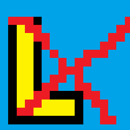

<!--
This template is based on https://github.com/othneildrew/Best-README-Template
-->


<!-- PROJECT SHIELDS -->
<!--
*** I'm using markdown "reference style" links for readability.
*** Reference links are enclosed in brackets [ ] instead of parentheses ( ).
*** See the bottom of this document for the declaration of the reference variables
*** for contributors-url, forks-url, etc. This is an optional, concise syntax you may use.
*** https://www.markdownguide.org/basic-syntax/#reference-style-links
-->
<!-- [![Contributors][contributors-shield]][contributors-url]
[![Forks][forks-shield]][forks-url]
[![Stargazers][stars-shield]][stars-url]
[![Issues][issues-shield]][issues-url]
[![MIT License][license-shield]][license-url]
[![LinkedIn][linkedin-shield]][linkedin-url] -->


<!-- PROJECT LOGO -->
<br />
<p align="center">
  <a href="https://github.com/allannozomu/dias-sem-lol">
    
  </a>

  <h1 align="center">Dias sem LoL</h1>

  <p align="center">
    Tracking how much time you stayed away from LoL!
    <br />
    <a href="https://github.com/allannozomu/dias-sem-lol"><strong>Explore the docs »</strong></a>
    <br />
    <br />
    <a href="https://allannozomu.github.io/dias-sem-lol/">View Demo</a>
    ·
    <a href="https://github.com/allannozomu/dias-sem-lol/issues">Report Bug</a>
    ·
    <a href="https://github.com/allannozomu/dias-sem-lol/issues">Request Feature</a>
  </p>
</p>


<!-- TABLE OF CONTENTS -->
<details open="open">
  <summary>Table of Contents</summary>
  <ol>
    <li>
      <a href="#about-the-project">About The Project</a>
      <ul>
        <li><a href="#built-with">Built With</a></li>
        <li><a href="#system-design">System Desing</a></li>
      </ul>
    </li>
    <li>
      <a href="#getting-started">Getting Started</a>
      <ul>
        <li><a href="#prerequisites">Prerequisites</a></li>
        <li><a href="#run">Run</a></li>
        <li><a href="#deploy">Deploy</a></li>
      </ul>
    </li>
    <li><a href="#license">License</a></li>
    <li><a href="#contact">Contact</a></li>
  </ol>
</details>


<!-- ABOUT THE PROJECT -->
## About The Project

[![Product Name Screen Shot][product-screenshot]](https://example.com)

Dias-sem-lol is a personal project that track how much time has passed since my last League of Legends match. The main objective is actually to incentive me to not play this game too much. It separate the time in days, hours, minutes and seconds.

There are some features:
* Shows when the last match occured (start time of it);
* Keeps track of my longest time without plating League of Legends so far;
* Update for new information every 10 minutes, displaying the last update time at the footer.

### Built With

The main language used in this project was Elm. There are some code written also in Javascript in the cloud functions to fecth the data from the Riot Games API and CSS for styling.
* [Create Elm App](https://github.com/halfzebra/create-elm-app)
* [Firebase](https://firebase.google.com/)
* [Riot Games API](https://developer.riotgames.com/)

### System design

This project is being separated in two parts:
1. Frontend
2. Scheduler Cloud Function and Storage

![Product Name Screen Shot][system-diagram]

#### Frontend

The Frontend is an Elm written project. It generates an static website that is currently being hosted in Github Pages.

#### Scheduler Cloud Function and Storage

For fetching the data from the Riot Games API, a Google Cloud function is being triggered by Google Cloud Scheduler every 10 minutes. 
This Cloud function has a code written in Javascript that fetches the data from the Riot Games API and stores it at Google Firestore.
There are 3 informations being stores:
```json
"longestSoFar" : 1234, // long, longest time in milliseconds
"lastPlayedInMillis" : 1234, // long, timestamp of the last match
"lastUpdate" : 1234, // long, timestamp of when this function runned
```

<!-- GETTING STARTED -->
## Getting Started

Basically, most of the setup is based in the [Create Elm App](https://github.com/halfzebra/create-elm-app/blob/master/template/README.md#elm-app-start).
To get a local copy up and running follow these simple example steps.

### Prerequisites

You will need to install `create-elm-app`

#### Yarn
```sh
yarn global add create-elm-app
```
#### NPM
```sh
npm install create-elm-app -g
```

## Run

```sh
elm-app start
```

Runs the app in the development mode.

The browser should open automatically to http://localhost:3000. If the browser does not open, you can open it manually and visit the URL.

The page will reload if you make edits. You will also see any lint errors in the console.

You may change the listening port number by using the `PORT` environment variable. For example type `PORT=8000 elm-app start` into the terminal/bash to run it from: http://localhost:8000/.

You can prevent the browser from opening automatically,

```
elm-app start --no-browser
```


## Deploy

1. Build the static site
   ``` sh
   elm-app build
   ```
2. Deploy to Github Pages using `gh-pages`
    This project uses [gh-pages](https://www.npmjs.com/package/gh-pages) to upload files from the `build` directly to GitHub.

    ```sh
    gh-pages -d build
    ```

<!-- LICENSE -->
## License

Distributed under the MIT License. See [LICENSE](https://raw.githubusercontent.com/AllanNozomu/dias-sem-lol/main/LICENSE) for more information.


<!-- CONTACT -->
## Contact

Project Link: [https://github.com/allannozomu/dias-sem-lol](https://github.com/allannozomu/dias-sem-lol)

[product-screenshot]: public/screenshot.png
[system-diagram]: public/diagram.png
